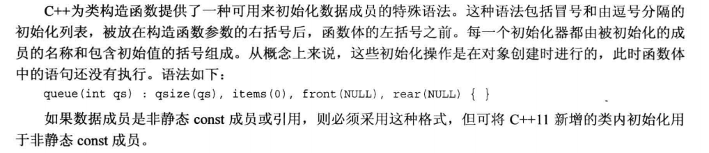
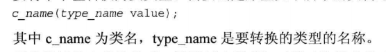
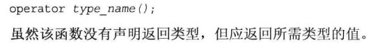
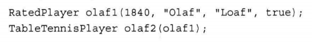
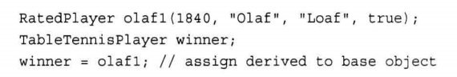
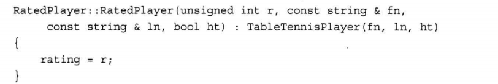
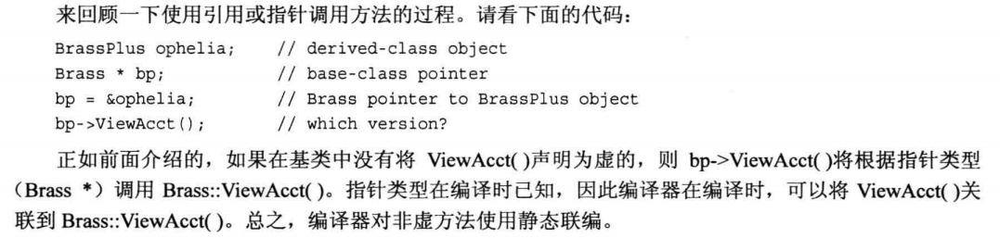

<!-- Some Notes of Studying C-- primer plus -->

<div>

## 目录

<!--
8. [第八章 函数探幽](#chapter8)
9. [第九章 内存模型与命名空间](#chapter9)
10. [第十章 对象与类](#chapter10)
11. [第十一章 使用类](#chapter10) 
12. -->

13. [第十二章 类与动态内存分配](#chapter12)
14. [第十三章 类继承](#chapter13)

-----

</div>

<!----- Content ----->

 <!-- 此处为预留的以往章节内容
 <h1 id='#chapter8'>第八章 函数探幽</h1> 
 <h1 id='#chapter9'>第九章 内存模型与命名空间</h1>
 <h1 id='#chapter10'>第十章 对象与类</h1>
 <h1 id='#chapter10'>第十一章 使用类</h1> 
 -->


<!-- 
##################### 分隔线 ######################
 -->

<h1 id='chapter12'>第十二章 类与动态内存分配</h1>

<div class="chapterContent">
<br/>

&emsp;**本章内容:**

  <span class="chapterContent_">

  - 在构造函数中使用new的注意事项
  - 复制构造函数
  - 包含类成员的类的逐成员赋值
  - 有关返回对象的说明
  - 指向对象的指针
  - 使用new初始化对象
  - 析构函数调用
  - 类构造函数初始化数据成员的特殊语法
  - 本章技术的应用

  </span>

<br/>
</div>

---
### 在构造函数中使用new的注意事项

+ 在析构函数中必须使用delete。
+ new和delete必须互相兼容。
    `new -> delete ; new[] -> delete[]`
+ 如果有多个构造函数，则必须以相同的方式使用new。因为只有一个析构函数，所有的构造函数必须与其格式兼容。

---
### 复制构造函数

+ 深度复制
  > 为新对象在堆中重新分配一块内存，所以对新对象的操作不会影响原始对象。

+ 重载赋值运算符
  + 检查自我赋值情况
  + 释放成员指针以前指向的内存
  + 通过深度复制将一个对象赋值给另一个对象
  + 返回一个指向调用对象的引用

---
### 包含类成员的逐成员赋值

+ 不需要为该类另编写复制构造函数和赋值运算符
+ 复制成员类成员时，将自动使用成员类的复制构造函数和赋值运算符

---
### 有关返回对象（函数返回值类型）的说明

+ 返回指向const对象的引用
  + 返回对象会调用复制构造函数，返回引用则不会
  + 引用指向的对象应该在调用函数执行时存在

+ 返回指向非const对象的引用
  + 重载赋值运算符
  + <<运算符
  
+ 返回局部变量对象
  + 如果被返回的对象是被调用函数中的局部变量，则不应该以引用方式返回
    ` 被调用函数执行完之后，局部对象将调用其析构函数 `
  + 算术运算符
  
+ 返回const 对象
  + 对于重载的+运算符，有着奇异的特性
    ```cpp
    net = force1 + force2 ;
    force1 + force2 = net ; //此行也是合法的代码
    cout << (force1+force2=net).val() << endl ; //同样合法
    ```  

  + 可行原因
    + 复制构造函数将创建一个临时变量表示返回值
    + 在语句1中，临时变量被赋值给net
    + 在语句2和3中，net被赋值给该临时变量 
  + 如何防止这种现象发生？
    + 将返回类型声明为 ` const classname `
    + 这样做会导致只有语句1合法，语句2和语句3成为非法语句

---
### 指向对象的指针

+ 指向对象的指针再更换指向的对象时，由于不创建新的对象，因此不要求使用new来分配内存。
+ 使用常规表示法来声明指向对象的指针
  `示例：String * glamour`
+ 可以将指针初始化为指向已有的对象
  `示例：String * first = &saying[0]`
+ 可以用new来初始化指针，这将创建一个新的对象
  > 对类使用new将调用相应的类的构造函数来初始化新创建的对象
+ 可以通过->运算符通过指针访问类方法
+ 可以通过对对象指针应用解除引用运算符（*）来获得对象

---
### 使用new初始化对象


---
### 析构函数调用

+ 如果对象是动态变量。当执行完定义该对象的程序块时，将调用该对象的析构函数。
+ 如果对象是静态变量，则在程序结束时调用对象的析构函数。
+ 如果对象是由new创建的，则仅当显式地使用delete删除对象时，其析构函数才会调用。

---
### 类构造函数初始化数据成员的特殊语法



---
### 本章技术的应用

+ 重载<<运算符
  + 重新定义<<运算符，以便将其和cout一起用来显示对象内容
  + 需要定义<<的友元运算符函数
    + 
+ 转换函数
  + 将单个基本类型的值转换成类类型，需要创建原型如下的类构造函数
    
  + 要将类转换为其他类型，需要创建原型如下的类构造函数
    
  + 使用转换函数时要小心。可以在声明构造函数时使用关键字`explicit` ， 以防止它被用于隐式转换。 
    + explicit作用
        > 在C++中，explicit关键字用来修饰类的构造函数，被修饰的构造函数的类，不能发生相应的隐式类型转换，只能以显示的方式进行类型转换。

-----

<!-- 
##################### 分隔线 ######################
 -->

<h1 id='chapter13'>第十三章 类继承</h1>

> 继承：修改和拓展类的一种方法。能够从已有的类派生出新的类，新的类继承基类的所有特征，包括方法

<div class="chapterContent">
<br/>

&emsp;**本章内容：**

  <span class="chapterContent_">

  + 继承可完成的工作
  + 派生类
  + 派生类与基类的关系
  + 构造函数成员初始化列表
  + 继承的方式
  + 多态与虚成员函数
  + 静态联编与动态联编
  + 向下强制转换与向下强制转换

  </span>
  
<br/>
</div>

### 继承可完成的工作

+ 在基类的基础上添加功能
+ 给类添加数据
+ 修改类方法的行为

---
### 派生类

<br/>

#### 基类与派生类

&emsp;从一个类派生出另一个类时，原始类称为基类，继承类称为派生类。

#### 语法

 基类:  `class BasicClass { ······ } ;`
 派生类: `class exClass : public BasicClass { ······ } ;`

#### 派生类声明

+ 冒号指出exClass类的基类是BasicClass类
+ 上述特殊的声明头表示exClass是一个公有基类，这被称为公有派生
  + 公有派生中，基类的公有成员将成为派生类的公有成员
  + 基类的私有部分也将成为派生类的一部分，但只能通过基类的公有和保护方法访问

#### 派生类特征

+ 储存了基类的数据成员
  > 继承了基类的实现

+ 可以使用基类的方法
  > 继承了基类的接口

#### 派生类需要添加的特性

+ 派生类需要自己的构造函数
  > 构造函数必须给新成员和继承的成员提供数据

+ 派生类可以根据需要添加额外的数据成员和成员函数

---

### 派生类和基类的关系

<br/>

> 基类指针或引用只能调用基类方法，不能调用派生类方法

+ 可以将基类对象初始化为派生类对象
  
+ 可以将派生类对象赋给基类对象
  
+ 派生类可以使用基类的 **非私有** 方法

#### 引用兼容属性

+ 基类指针可以在不进行显式类型转换的情况下指向派生类对象
+ 基类引用可以在不进行显式类型转换的情况下引用派生类对象

#### 继承的单向性
> 不可以将基类对象和地址赋给派生类引用和指针

---

### 构造函数成员初始化列表

&emsp;如果Class是一个类，而mem1,mem2,mem3都是这个类的数据成员，则可以使用一下语法来初始化数据成员：

```cpp
Class :: Classy( int n , int m ) : 
mem1(n) , mem2(0) , mem3(n*m+2) {······} 
```

> 上述代码将mem1初始化为n，mem2初始化为0，mem3初始化为n*m+2。

初始化工作是在对象创建时完成的，此时还未执行构造函数内的任何代码。

#### 注意

+ 这种格式只能用于构造函数
+ 必须用这种格式初始化**非静态const**数据成员
+ 必须用这种格式初始化**引用**数据成员

成员被初始化的顺序与它们出现在类声明中的顺序相同，与初始化器中的排列顺序无关。

#### 访问权限

派生类不能直接访问基类的私有成员，必须通过基类方法进行访问
> 派生类构造函数必须使用基类构造函数

#### 派生类构造函数

+ 创建派生类对象时，程序首先创建基类对象。C++使用成员初始化列表语法来完成这种工作
   

+ 要点
  - 首先创建基类对象
  - 派生类构造函数通过成员初始化列表将积累信息传递给基类构造函数
  - 派生类构造函数初始化派生类新增的数据成员
  - 派生类对象过期时，程序首先调用派生类析构函数，然后调用基类析构函数

---

### 继承的方式

+ 公有继承
+ 私有继承
+ 保护继承

#### 公有继承

+ 建立 `is-a` 关系
  > 即is-a-kind-of关系，派生类对象同时也是一个基类对象，对基类对象能执行的任何操作也可以对派生类执行
+ 公有继承不建立 `has-a` , `is-like-a` , `is-implemented-as-a（作为···来实现）`, `uses-a` 关系

---

### 多态和虚成员函数

多态：`同一个方法的行为取决于调用该方法的对象`

实现机制：
> + 在派生类中重新定义积累的方法
> + 使用虚方法

#### 虚方法

> 如果要在派生类中重新定义基类的方法，通常应将基类方法声明为虚的。

**关键字** : `virtual`

+ 方法在基类中被声明为虚的后，其在派生类中将**自动**成为虚方法
+ 程序将使用**对象类型**来确定使用哪个版本的虚方法
+ 如果方法是通过**引用或指针**而不是对象调用的，使用virtual后，程序将根据引用或指针指向的对象的类型来选择方法
  > 未使用virtual时，程序将根据引用或指针本身的类型==来选择方法

#### 虚析构函数

+ 目的：释放派生对象时，按照正确的顺序调用析构函数
+ 如果析构函数不是虚的，则将只调用对应于指针类型的析构函数
  > 即使指针指向的是exClass对象，仍会调用basicClass的析构函数
+ 如果析构函数是虚的，则调用相应对象类型的析构函数

#### 虚方法的多态性

&emsp;创建指向基类的指针数组，由于虚方法特性，该数组既可以指向基类对象，也可以指向派生类对象。即可以使用一个数组表示多种类型的对象。

#### 有关虚函数的注意事项

1. 在基类方法的声明中使用关键字`virtual`可使该方法在基类以及**所有**派生类中是虚的
2. 如果使用**指向对象的引用**来调用虚方法，将使用*动态联编*
3. 如果定义的类将被用作基类，则应该将那些要在派生类中重新定义的类方法声明为虚的
4. 构造函数**不能**是虚函数
5. 当一个类被用作基类时，其析构函数应当是虚函数
6. 友元不能是虚函数：<font color=#009ad6>友元不是类成员。只有类成员才能是虚函数</font>
7. 如果派生类没有重新定义函数，则使用该函数的基类版本
8. **重新定义**将隐藏原有方法
   + 重新定义继承的方法并不是重载
   + 如果再派生类中重新定义函数，将不再使用相同的函数特征标覆盖基类声明，而是隐藏同名的基类方法，不管其参数特征标如何
    

#### 两条重要经验规则

+ 如果重新定义继承的方法，应确保与原来的原型完全相同。
+ 如果返回类型是基类引用或指针，则可以修改为指向派生类的引用或指针。

> 返回类型协变，允许返回类型随类类型的变化而变化

---

### 静态联编与动态联编

+ **函数名联编**
  > 将源代码中的函数调用解释为执行特定的函数代码块

+ **静态联编**
  > 在编译过程中进行联编，又称早期联编
  - 虚成员函数与静态联编
    * 编译器对虚方法使用静态联编
     
    * 如果在基类中将ViewAcct()声明为虚，则bp->ViewAcct()会根据对象类型调用而非根据根据指针类型调用

+ **动态联编**
  > 在程序运行时选择正确的虚方法的联编，又称为晚期联编
  >
  > 虚函数令静态联编工作变的困难：使用那一个函数是不能在编译时确定的，因为编译器不知道用户将选择哪种类型的对象。

+ **为什么会有两种类型的联编以及默认为静态联编？**
  - 效率：
    > 动态联编会在运行阶段采取方法跟踪基类指针或引用指向的对象类型。增加了额外的处理开销。
    > 若派生类不重新定义基类的任何方法，也不需要使用动态联编。静态联编更合理且效率更高。
  - 概念模型
    * 在设计类时，可能包含一些不在派生类重新定义的成员函数。
    * 不将这些函数设置为虚函数的好处
      + 效率更高
      + 指出不需要重新定义该函数

---
### 向上和向下强制转换

+ **指针和引用类型的兼容性**
  > 动态联编与通过指针和引用调用方法相关——由继承控制

+ **向上强制转换** *upcasting*
  - 将派生类引用或指针转换为基类引用或指针
  - 该规则是 is-a 关系的一部分
  - 向上强制转换是可传递的

+ **向下强制转换** *downcasting*
  - 将基类指针或引用转换为派生类指针或引用
  - 如果不使用显式类型转换，向下强制转换是不被允许的。
    > 通常，is-a关系是不可逆的

 隐式向上强制转换使基类指针或引用可以指向基类对象或派生类对象
 > 需要动态联编的原因；C++使用虚成员函数来满足这种需求


 