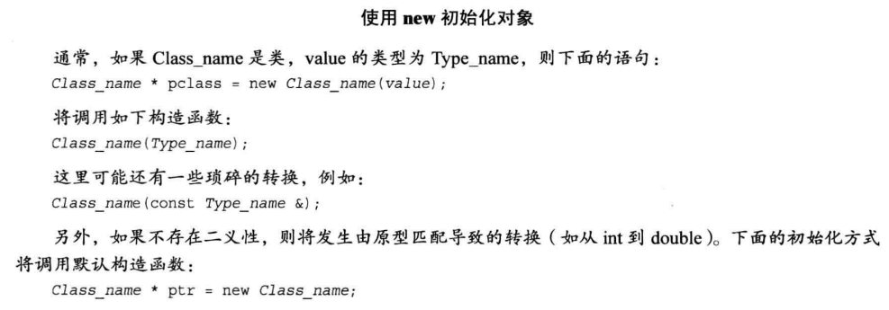
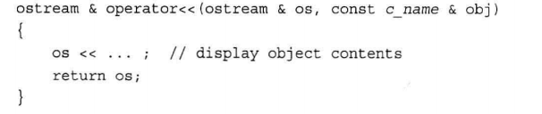

<!-- Some Notes of Studying C-- primer plus -->

## 目录

8. [第八章 函数探幽](#chapter8)
9. [第九章 内存模型与命名空间](#chapter9)
10. [第十章 对象与类](#chapter10)
11. [第十一章 使用类](#chapter10)
12. [第十二章 类与动态内存分配](#chapter12)
13. [第十三章 类继承](#chapter13)

-----

 <h1 id='#chapter8'>第八章 函数探幽</h1> 
 <h1 id='#chapter9'>第九章 内存模型与命名空间</h1>
 <h1 id='#chapter10'>第十章 对象与类</h1>
 <h1 id='#chapter10'>第十一章 使用类</h1>

<!-- 此处为预留的以往章节的内容 -->


<h1 id='chapter12'>第十二章 类与动态内存分配</h1>


-----

+ 本章内容
  - 在构造函数中使用new的注意事项
  - 复制构造函数
  - 包含类成员的类的逐成员赋值
  - 有关返回对象的说明
  - 指向对象的指针
  - 使用new初始化对象
  - 析构函数调用
  - 类构造函数初始化数据成员的特殊语法
  - 本章技术的应用

### 在构造函数中使用new的注意事项

+ 在析构函数中必须使用delete。
+ new和delete必须互相兼容。
    `new -> delete ; new[] -> delete[]`
+ 如果有多个构造函数，则必须以相同的方式使用new。因为只有一个析构函数，所有的构造函数必须与其格式兼容。

### 复制构造函数

+ 深度复制
> 为新对象在堆中重新分配一块内存，所以对新对象的操作不会影响原始对象。

+ 重载赋值运算符
  + 检查自我赋值情况
  + 释放成员指针以前指向的内存
  + 通过深度复制将一个对象赋值给另一个对象
  + 返回一个指向调用对象的引用

### 包含类成员的逐成员赋值

+ 不需要为该类另编写复制构造函数和赋值运算符
+ 复制成员类成员时，将自动使用成员类的复制构造函数和赋值运算符

### 有关返回对象（函数返回值类型）的说明

+ 返回指向const对象的引用
  + 返回对象会调用复制构造函数，返回引用则不会
  + 引用指向的对象应该在调用函数执行时存在

+ 返回指向非const对象的引用
  + 重载赋值运算符
  + <<运算符
  
+ 返回局部变量对象
  + 如果被返回的对象是被调用函数中的局部变量，则不应该以引用方式返回
    ` 被调用函数执行完之后，局部对象将调用其析构函数 `
  + 算术运算符
  
+ 返回const 对象
  + 对于重载的+运算符，有着奇异的特性
    ```cpp
    net = force1 + force2 ;
    force1 + force2 = net ; //此行也是合法的代码
    cout << (force1+force2=net).val() << endl ; //同样合法
    ```  

  + 可行原因
    + 复制构造函数将创建一个临时变量表示返回值
    + 在语句1中，临时变量被赋值给net
    + 在语句2和3中，net被赋值给该临时变量 
  + 如何防止这种现象发生？
    + 将返回类型声明为 ` const classname `
    + 这样做会导致只有语句1合法，语句2和语句3成为非法语句

### 指向对象的指针

+ 指向对象的指针再更换指向的对象时，由于不创建新的对象，因此不要求使用new来分配内存。
+ 使用常规表示法来声明指向对象的指针
  `示例：String * glamour`
+ 可以将指针初始化为指向已有的对象
  `示例：String * first = &saying[0]`
+ 可以用new来初始化指针，这将创建一个新的对象
  > 对类使用new将调用相应的类的构造函数来初始化新创建的对象
+ 可以通过->运算符通过指针访问类方法
+ 可以通过对对象指针应用解除引用运算符（*）来获得对象

### 使用new初始化对象



### 析构函数调用

+ 如果对象是动态变量。当执行完定义该对象的程序块时，将调用该对象的析构函数。
+ 如果对象是静态变量，则在程序结束时调用对象的析构函数。
+ 如果对象是由new创建的，则仅当显式地使用delete删除对象时，其析构函数才会调用。

### 类构造函数初始化数据成员的特殊语法


### 本章技术的应用

+ 重载<<运算符
  + 重新定义<<运算符，以便将其和cout一起用来显示对象内容
  + 需要定义<<的友元运算符函数
    + 
+ 转换函数
  + 将单个基本类型的值转换成类类型，需要创建原型如下的类构造函数
    
  + 要将类转换为其他类型，需要创建原型如下的类构造函数
    
  + 使用转换函数时要小心。可以在声明构造函数时使用关键字`explicit` ， 以防止它被用于隐式转换。 
    + explicit作用
        > 在C++中，explicit关键字用来修饰类的构造函数，被修饰的构造函数的类，不能发生相应的隐式类型转换，只能以显示的方式进行类型转换。

-----

<h1 id='chapter13'>第十三章 类继承</h1>