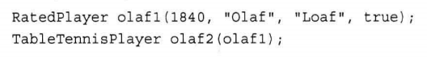
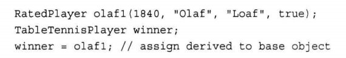
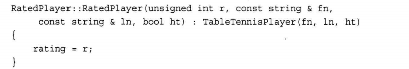
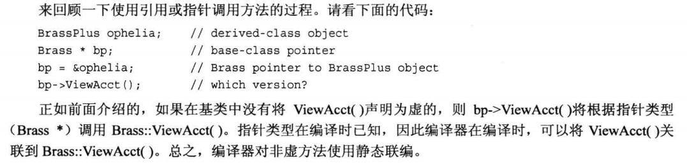
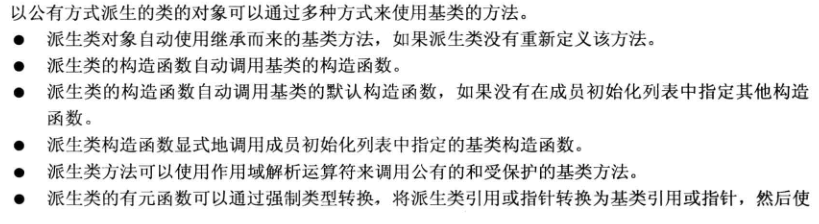
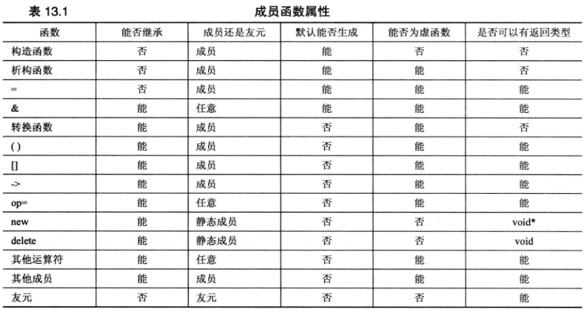

<h1 id='chapter13'>第十三章 类继承</h1>

> 继承：修改和拓展类的一种方法。能够从已有的类派生出新的类，新的类继承基类的所有特征，包括方法

<div class="chapterContent">
<br/>

&emsp;**本章内容：**

  <span class="chapterContent_">

  + 继承可完成的工作
  + 派生类
  + 派生类与基类的关系
  + 构造函数成员初始化列表
  + 继承的方式
  + 多态与虚成员函数
  + 静态联编与动态联编
  + 向下强制转换与向下强制转换

  </span>
  
<br/>
</div>

### 继承可完成的工作

+ 在基类的基础上添加功能
+ 给类添加数据
+ 修改类方法的行为

---
### 派生类

<br/>

#### 基类与派生类

&emsp;从一个类派生出另一个类时，原始类称为基类，继承类称为派生类。

#### 语法

 基类:  `class BasicClass { ······ } ;`
 派生类: `class exClass : public BasicClass { ······ } ;`

#### 派生类声明

+ 冒号指出exClass类的基类是BasicClass类
+ 上述特殊的声明头表示exClass是一个公有基类，这被称为公有派生
  + 公有派生中，基类的公有成员将成为派生类的公有成员
  + 基类的私有部分也将成为派生类的一部分，但只能通过基类的公有和保护方法访问

#### 派生类特征

+ 储存了基类的数据成员
  > 继承了基类的实现

+ 可以使用基类的方法
  > 继承了基类的接口

#### 派生类需要添加的特性

+ 派生类需要自己的构造函数
  > 构造函数必须给新成员和继承的成员提供数据

+ 派生类可以根据需要添加额外的数据成员和成员函数

---

### 派生类和基类的关系

<br/>

> 基类指针或引用只能调用基类方法，不能调用派生类方法

+ 可以将基类对象初始化为派生类对象
  
+ 可以将派生类对象赋给基类对象
  
+ 派生类可以使用基类的 **非私有** 方法

#### 引用兼容属性

+ 基类指针可以在不进行显式类型转换的情况下指向派生类对象
+ 基类引用可以在不进行显式类型转换的情况下引用派生类对象

#### 继承的单向性
> 不可以将基类对象和地址赋给派生类引用和指针

---

### 构造函数成员初始化列表

&emsp;如果Class是一个类，而mem1,mem2,mem3都是这个类的数据成员，则可以使用一下语法来初始化数据成员：

```cpp
Class :: Classy( int n , int m ) : 
mem1(n) , mem2(0) , mem3(n*m+2) {······} 
```

> 上述代码将mem1初始化为n，mem2初始化为0，mem3初始化为n*m+2。

初始化工作是在对象创建时完成的，此时还未执行构造函数内的任何代码。

#### 注意

+ 这种格式只能用于构造函数
+ 必须用这种格式初始化**非静态const**数据成员
+ 必须用这种格式初始化**引用**数据成员

成员被初始化的顺序与它们出现在类声明中的顺序相同，与初始化器中的排列顺序无关。

#### 访问权限

派生类不能直接访问基类的私有成员，必须通过基类方法进行访问
> 派生类构造函数必须使用基类构造函数

  + 访问控制：`protected`
    > `proteceted`与`private`相似，在类外只能使用公有类成员来访问。
    > 派生类的成员可以直接访问基类的`protected`成员

#### 派生类构造函数

+ 创建派生类对象时，程序首先创建基类对象。C++使用成员初始化列表语法来完成这种工作
   

+ 要点
  - 首先创建基类对象
  - 派生类构造函数通过成员初始化列表将积累信息传递给基类构造函数
  - 派生类构造函数初始化派生类新增的数据成员
  - 派生类对象过期时，程序首先调用派生类析构函数，然后调用基类析构函数

---

### 继承的方式

+ 公有继承
+ 私有继承
+ 保护继承

#### 公有继承

+ 建立 `is-a` 关系
  > 即is-a-kind-of关系，派生类对象同时也是一个基类对象，对基类对象能执行的任何操作也可以对派生类执行
+ 公有继承不建立 `has-a` , `is-like-a` , `is-implemented-as-a（作为···来实现）`, `uses-a` 关系

---

### 多态和虚成员函数

多态：`同一个方法的行为取决于调用该方法的对象`

实现机制：
> + 在派生类中重新定义积累的方法
> + 使用虚方法

#### 虚方法

> 如果要在派生类中重新定义基类的方法，通常应将基类方法声明为虚的。

**关键字** : `virtual`

+ 方法在基类中被声明为虚的后，其在派生类中将**自动**成为虚方法
+ 程序将使用**对象类型**来确定使用哪个版本的虚方法
+ 如果方法是通过**引用或指针**而不是对象调用的，使用virtual后，程序将根据引用或指针指向的对象的类型来选择方法
  > 未使用virtual时，程序将根据引用或指针本身的类型==来选择方法

#### 虚析构函数

+ 目的：释放派生对象时，按照正确的顺序调用析构函数
+ 如果析构函数不是虚的，则将只调用对应于指针类型的析构函数
  > 即使指针指向的是exClass对象，仍会调用basicClass的析构函数
+ 如果析构函数是虚的，则调用相应对象类型的析构函数

#### 虚方法的多态性

&emsp;创建指向基类的指针数组，由于虚方法特性，该数组既可以指向基类对象，也可以指向派生类对象。即可以使用一个数组表示多种类型的对象。

#### 有关虚函数的注意事项

1. 在基类方法的声明中使用关键字`virtual`可使该方法在基类以及**所有**派生类中是虚的
2. 如果使用**指向对象的引用**来调用虚方法，将使用*动态联编*
3. 如果定义的类将被用作基类，则应该将那些要在派生类中重新定义的类方法声明为虚的
4. 构造函数**不能**是虚函数
5. 当一个类被用作基类时，其析构函数应当是虚函数
6. 友元不能是虚函数：<font color=#009ad6>友元不是类成员。只有类成员才能是虚函数</font>
7. 如果派生类没有重新定义函数，则使用该函数的基类版本
8. **重新定义**将隐藏原有方法
   + 重新定义继承的方法并不是重载
   + 如果再派生类中重新定义函数，将不再使用相同的函数特征标覆盖基类声明，而是隐藏同名的基类方法，不管其参数特征标如何
    

#### 两条重要经验规则

+ 如果重新定义继承的方法，应确保与原来的原型完全相同。
+ 如果返回类型是基类引用或指针，则可以修改为指向派生类的引用或指针。

> 返回类型协变，允许返回类型随类类型的变化而变化

---

### 静态联编与动态联编

+ **函数名联编**
  > 将源代码中的函数调用解释为执行特定的函数代码块

+ **静态联编**
  > 在编译过程中进行联编，又称早期联编
  - 虚成员函数与静态联编
    * 编译器对虚方法使用静态联编
     
    * 如果在基类中将ViewAcct()声明为虚，则bp->ViewAcct()会根据对象类型调用而非根据根据指针类型调用

+ **动态联编**
  > 在程序运行时选择正确的虚方法的联编，又称为晚期联编
  >
  > 虚函数令静态联编工作变的困难：使用那一个函数是不能在编译时确定的，因为编译器不知道用户将选择哪种类型的对象。

+ **为什么会有两种类型的联编以及默认为静态联编？**
  - 效率：
    > 动态联编会在运行阶段采取方法跟踪基类指针或引用指向的对象类型。增加了额外的处理开销。
    > 若派生类不重新定义基类的任何方法，也不需要使用动态联编。静态联编更合理且效率更高。
  - 概念模型
    * 在设计类时，可能包含一些不在派生类重新定义的成员函数。
    * 不将这些函数设置为虚函数的好处
      + 效率更高
      + 指出不需要重新定义该函数

---

### 向上和向下强制转换

+ **指针和引用类型的兼容性**
  > 动态联编与通过指针和引用调用方法相关——由继承控制

+ **向上强制转换** *upcasting*
  - 将派生类引用或指针转换为基类引用或指针
  - 该规则是 is-a 关系的一部分
  - 向上强制转换是可传递的

+ **向下强制转换** *downcasting*
  - 将基类指针或引用转换为派生类指针或引用
  - 如果不使用显式类型转换，向下强制转换是不被允许的。
    > 通常，is-a关系是不可逆的

 隐式向上强制转换使基类指针或引用可以指向基类对象或派生类对象
 > 需要动态联编的原因；C++使用虚成员函数来满足这种需求

---

### 抽象基类（ABC）

#### 概念

&emsp; 不完整的类，包含所有派生类的共性。当类声明中包含纯虚函数时，该类不能被创建对象，只能作为基类。

#### 纯虚函数

+ C++ 使用 `纯虚函数` 提供未实现的函数。
+ 纯虚函数声明的结尾处为=0
+ 抽象基类中不可以定义该函数

*理念：*
> 包含纯虚函数的类只应用作基类

```cpp
virtual double Area() = 0 ;
```

#### ABC理念

&emsp;ABC方法更具有系统性、更规范。设计ABC之前，应开发一个模型，指出编程问题所需的类以及他们之间的互相关系。

&emsp;ABC可视为一种必须实施的接口。ABC要求具体派生类覆盖其纯虚函数——迫使派生类遵循ABC设置的接口规则。

---

### 继承与动态内存分配

+ 继承是怎样与动态内存分配(`new`与`delete`)互动的？
  + 例如基类使用动态内存分配并且重新定义赋值与赋值构造函数，将会如何影响派生类实现

问题的答案取决于派生类的属性：

#### 派生类使用动态内存分配

&emsp;假设基类`baseDMA`使用了动态内存分配。在其声明中包含了构造函数使用new时需要的特殊方法：析构函数、复制构造函数、重载赋值运算符函数。

&emsp;现在，从`baseDMA`派生出`lackDMA`类，其不使用new，也未包含其他一些需要特殊处理的特性。

==不需要为`lackDMA`类定义显式析构函数、复制构造函数与赋值运算符==

*原因:*

+ 析构函数
  > 如果没有定义析构函数，编译器将定义一个不执行任何操作的默认构造函数。实际上，派生类的默认构造函数会在执行自身的代码后调用基类析构函数。因为我们假设lackDMA成员不需要之心任何特殊操作，所以默认析构函数是合适的。

+ 复制构造函数
  > 默认复制构造函数执行成员复制。成员复制将根据数据类型采用相应的复制方式：复制类成员或继承的组件时，使用的是该类的复制构造函数。所以lackDMA类的默认复制构造函数使用显式baseDMA复制构造函数来赋值lackDMA对象的baseDMA部分。

+ 重载赋值运算符函数
  > 类的默认赋值运算符将自动使用基类的赋值运算符来对基类组件进行赋值。

派生类对象的这些属性也适用于本身是对象的类成员。

#### 派生类使用动态内存分配

&emsp; 在这种情况下，必须为派生类定义显式析构函数、复制构造函数和赋值运算符。

---

### 使用动态内存分配和友元的继承

&emsp;对于基类baseDMA和派生类lackDMA、hasDMA，存在友元函数：
```cpp
std::ostream & operator<< (std::ostream & os , const hasDMA & hs) ;
```

作为hasDMA类的友元，该函数能够访问hasDMA的私有成员。但不能范根baseDMA的成员。
> 解决方案是使用baseDMA类的友元函数operator<<() 。

&emsp；因为友元不是成员函数，所以不能使用作用域解析运算符来指出要使用哪个函数，因此我们需要使用**强制类型转换**，以便匹配远行的时候能够选择正确的函数。

```cpp
std::ostream & operator<< (std::ostream & os , const hasDMA & hs)
{
  os << (const baseDMA &) hs;
  os << "person:" << hs.person << endl;
  return os ;
}
```

---

### 类设计回顾

#### 编译器生成的成员函数

&emsp;编译器会自动生成一些公有成员函数——特殊成员函数，这表明这些特殊成员函数很重要：

+ 默认构造函数
  + 自动生成的默认构造函数会调用基类的默认构造函数，以及调用**本身是对象的成员**所属类的默认构造函数。
  + 如果派生类构造函数的成员初始化列表中没有显式调用基类构造函数，编译器将使用基类的默认构造函数来构造派生类对象的基类部分。在这种情况下，如果积累没有构造函数，将导致编译错误。
  + 如果定义了某种构造函数，编译器将不会定义默认构造函数，需要自己提供默认构造函数。
  + 如果类包含指针成员，则必须初始化这些成员。因此一个显式的默认构造函数能够将所有的类数据成员都初始化为合理的值。
  
+ 复制构造函数
  + 如果程序没有使用复制构造函数，编译器将提供原型，但不提供函数定义。
  + 如果使用类包含new初始化的成员指针(需要深复制)，或者需要修改的静态变量，则应提供显式复制构造函数。
  + 在下列情况下，将使用复制构造函数：
    + 将新对象初始化为一个同类对象
    + 按值将对象传递给函数
    + 函数按值返回对象
    + 编译器生成临时对象
  
  + 赋值运算符
    + 默认的赋值运算符用于处理同类对象之间的赋值。
    + 赋值和初始化的区别：
      + 初始化：语句创建了新的对象
      + 赋值：修改已有对象的值
    + 编译器不会生成将一种类型赋值给另一种类型的赋值运算符。
      + 如果要这么做，需要显式定义自己的赋值运算符
      + 或使用转换函数，将另一类型转换成本类型

#### 公有继承的考虑因素

1. `is-a`关系
   + 要遵循`is-a`关系。如果派生类不是一种特殊的基类，则不要使用公有派生。

2. 什么不能被继承
   + 构造函数、析构函数、赋值运算符

3. 虚方法
   + 设计基类时，必须确定是否将类方法声明为虚的。不适当的代码将阻止动态联编：按引用传递对象而非按值传递对象。

4. 析构函数
   + 基类的析构函数应当是虚的。通过指向对象的基类指针或引用删除派生对象时，程序首先调用派生类的析构函数，然后调用基类的析构函数。

5. 友元函数
   + 友元函数并非类成员，因此不能继承。可以通过强制类型转换，将派生类引用或指针转换为基类引用或指针，如此可以令派生类的友元函数能够使用基类的友元函数。

6. 有关使用基类方法的说明
   

7. 成员函数属性
   

