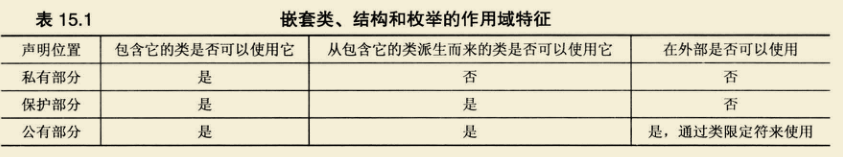

<h1 id='chapter15'>第十五章 类与动态内存分配</h1>

<div class="chapterContent">
<br/>

&emsp;**本章内容:**

  <span class="chapterContent_">

  - 友元类
  - 友元类方法
  - 嵌套类
  - 引发异常、try和catch
  - 异常类
  - 运行阶段类型识别（RTTI）
  - dynamic_cast和typeid
  - static_cast、const_cast和reiterpret_cast

  </span>

<br/>
</div>

&emsp;友元使得能够为类开发更灵活的接口。类可以将其它函数、其他类和其他类的成员函数作为友元。某些情况下，可能使用前向声明。

&emsp;引发异常将将终止当前执行的函数，将控制权传递给匹配的`catch`块。`catch`在`try`后,导致异常的函数调用必须位于`try`块内，才能捕获异常。类可以包含嵌套的异常类，异常类将在相应问题被发现是引发。函数可以包含异常规范。

&emsp;`RTTI`让程序能够检测对象的类型。`dynamic_cast`用于将派生类指针转换为基类指针。`Typeid`运算符返回`type_info`对象，可以对两个typeid返回值进行比较，确认对象的类型。`type_info`对象可用于获得关于对象的信息。

---

### 友元类

关系类比：  (既不是`is-a`也不是`has-a`)
> 电视和遥控器的联系:遥控器可以改变电视机的状态

定义:
```cpp
friemd class friendname;
```

#### 前向声明

&emsp;让特定的类成员成为另一个类的友元时，可能会导致逻辑上的相悖性。(A类必须知道友元B类成员的定义，而B类的方法提到了A类对象，导致悖论)。此时需要使用前向声明。

示例：
```cpp
class A;
class B {···};
class A {···};
```

> 先声明A类而不能先声明B类，原因在于在A类中看到友元B类成员之前，需要先知道该B类成员的声明。

> 让整个B类称为友元不需要前向声明，因为友元语句本身已经指出B是一个类。

#### 其他友元关系

1. 两个类彼此成为对方的友元
2. 共同的友元

---

### 嵌套类

&emsp;在C++中，可以在类声明放在另一个类中。包含类的成员函数可以创建和使用被嵌套类的对象；当且仅当声明位于公有部分时，才能在包含类的外面使用嵌套类，而且必须使用作用域解析运算符。

嵌套和包含的区别：

> 包含：类对象是另一个类的成员。

> 嵌套：不创建类成员，而是定义一种类型，该类型仅在包含嵌套类声明的类中有效(作用域)。

#### 访问权限

作用域:
    + 在另一个类的保护部分声明：
        > 对该类和该类的派生类可见，对外部不可见。 
    + 在另一个类的共有部分声明：
        > 允许该类、该类派生类和外部使用。 
        > 在外部使用它时，必须使用类限定符。
    

---

### 异常

#### `abort()`

&emsp;向标准错误流发送消息`abnormal program termination(程序异常终止)`。返回一个岁实现而异的值，告诉操作系统(或父进程)处理失败。

#### 返回错误码

&emsp;通过使用函数的返回值来指出问题。

#### 异常机制

对异常的处理:
+ 引发异常  `throw()`
+ 使用处理程序捕获异常 `catch()`
+ 使用try块 `try{}`

> throw会将异常传递给catch块

#### 栈解退

&emsp;若try块没有直接调用引发异常的函数，而是调用了对引发异常的函数进行调用的函数，则程序将从引发异常的函数调到包含try块和处理程序的函数。这涉及到了栈解退。

栈解退：

&emsp;假设函数由于出现异常而终止，则程序将释放栈中的内存，但不会在释放栈之的第一个返回地址后停止，而是继续释放栈，直到找到一个位于try块中的返回地址。随后，程序将转到块尾的异常处理程序开始执行，而不是函数调用后面的第一条语句。

模型：边切菜边烧水

```flow
st=>start: 边切菜边烧水
op=>operation: 切好一个菜后，关注水壶情况(检测异常)
cd=>condition: 水是否烧好(是否出现异常)
y=>end: 关火，提走开水(进入异常处理程序)
n=>end: 继续切下一个菜(回归正常流程)

st->op->cd
cd(yes)->y
cd(no)->n

```

---

### RTTI

&emsp; `RTTI`随后**运行阶段类型识别**的简写。

用途：
> 使用公共基类指针，指向不同的派生类时，检测指针指向对象的类型，从而调用正确版本的类方法，或在调试时跟踪生成的对象的类型，减少错误。

#### 元素

1. `dunamic_cast` 运算符
2. `typeid`运算符 和 `type_info`类

---

### 类型转换运算符

1. `daynamic_cast`

语法:
```cpp
dynamic_cast <type-name> (expression)
```

示例:
```cpp
B b = dynamic_cast(A) a;
```

上述表达式当且仅当A为b的`可访问类`时才成立。否则，则会赋给b一个空值。

用途:
> 使得能够在类层次结构中进行`向上类型转换`, 而不允许其他转换

2. `const_cast`

语法:
```cpp
const_cast <type-name> (expression)
```

其中,`type-name`和`expression`的类型必须相同。

示例:
```cpp
const int a = 1;

int * p = const_cast<int *>(&a);
```

上述代码令`p`成为一个可修改a的值的指针，它局部删除了`const`标签(仅仅对于`p`而言，`a`并非`const`值)。

用途：
&emsp;修改类型的`const`或`volatile`属性。
+ 常量指针被转换为非常量的指针，并且仍然指向原来的对象
+ 常量引用被转换为非常量的引用，并且仍然指向原来的对象

3. `static_cast`

语法:
```cpp
static_cast <type-name> (expression)
```

仅当`type-name`和``expression`二者中其一可以被隐式转换为另一元素的类型时，转换才成立。

示例：
+ 派生类指针向上转换到基类指针
+ 基类指针到派生类指针(无需真正进行类型转换，仅仅需要两者之间具有转换的渠道，这里可执行向下转换)

4. `reinterpret_cast`

语法:
```cpp
reinterpret_cast <type-name> (expression)
```
