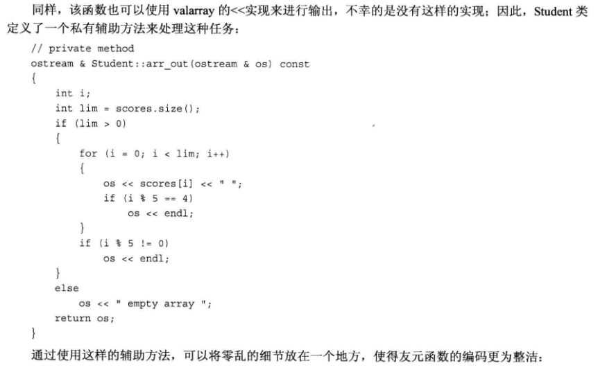
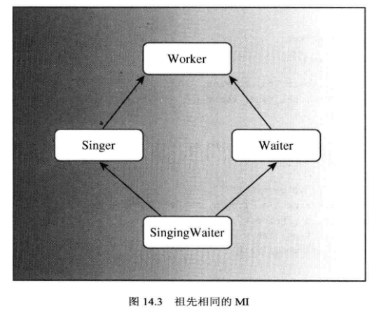

<h1 id='chapter12'>第十四章 C++中的代码重用</h1>

<div class="chapterContent">
<br/>

&emsp;**本章内容:**

  <span class="chapterContent_">

  + has-a 关系
  + 包含对象成员的类
  + 模板类valarray
  + 私有保护继承
  + 多重继承
  + 虚基类
  + 创建类模板
  + 使用类模板
  + 模板的具体化

  </span>

<br/>
</div>

---

### 包含*对象* 成员的类

#### 建立 has-a 关系

+ 组合（包含）技术

  即创建一个包含其他类对象的类。
  例如：
  ```cpp
  class student
  {
    private:
      string name;
      valarray<double> source;
      ···
  }
  ```
  &emsp;这意味着student类的成员函数可以使用string和valarray类的共有借口来访问和修改name和scores对象。


*接口和实现*

> &emsp;使用公有继承时，类可以集成接口，可能还有实现(基类的纯虚函数提供接口但不提供实现)。
> 获得接口是is-a的组成部分。而使用组合，类可以获得实现而不能获得接口。
> 不继承接口是has-a关系的组成部分。

---

### `valarray` 类

&emsp; valarray类是由头文件`valarray`支持的。

该类用于处理数值.支持诸如将数组中所有元素的值相加以及在数组中找出最大和最小值等操作。是一个`模板类`。

*定义:*
```cpp
valarray<typename> arrayname ;
// valarray数组支持初始化
valarray<typename> arrayname = {10,8} ;
```

下面是这个类的一些方法

 + `operator[]()`: 访问元素
 + `size()`: 返回包含的元素数
 + `sum()`: 返回所有元素的总和
 + `max()`: 返回最大元素
 + `min()`: 返回最小元素

#### 辅助方法

将零乱的细节放在一个地方，令友元函数的编码更为整洁。

example:

`和`valarry<double>::max()`可用，就像他们是Student的公有方法一样。

```cpp
cout << "high score: " << ada[i].max() << endl;
```

> 注：using只使用成员名——没有圆括号、函数特征标和返回类型。

例如:
```cpp
using atd::valarry<double>::operator[];
```

---

### 多重继承(MI)

&emsp;使用多个基类的继承被称为*多重继承*(MI)。通常，MI，尤其是公有MI将导致一些问题，必须使用额外的语法规则来解决他们。

&emsp;MI描述的是有多个直接基类的类。与单继承一样，公有MI表示的也是`is-a`关系。

> 必须使用关键字`public`限定每一个基类。否则编译器将默认认为是私有派生。

私有MI和保护MI可以表示`has-a`关系。

#### 使用多重继承

&emsp;对于student类：

```cpp
class Student : private std::string, private std::valarry<double>
{
  ···
}
```

1. 初始化基类组件

  &emsp;私有继承提供了两个无名称的子对象成员，隐式地继承了组件，因此不能使用显式的name和scores来描述对象。
  &emsp;对于继承类，新版本的构造函数将使用成员初始化列表语法，使用类名称而不是成员名来标识构造函数：
  ```cpp
  Student(const char * std, const double * pd, int n) 
    : std::string(str), ArrayDb(pd, n) {}
  ```
  > 省略了显式对象名称，并在内联构造函数中使用了类名而非成员名。

2. 访问基类的方法

  &emsp;使用私有继承时，只能在派生类的方法中使用基类的方法。
  &emsp;如果希望基类工具是公有的，例如`Average()`，可以在类声明中声明公有`Student::average()`，在该方法中使用私有`Student::Average()`函数。
  然而，私有继承能够使用类名和作用域解析运算符来调用基类的方法：
  ```cpp
  double Student::Average() const
  {
    if( ArrayDb::size() > 0 )
        return ArrayDb::sum() / ArrayDb::size();
    else
        return 0;
  } 
  ```
  > 使用包含时，将使用对象名来调用方法。
  > 使用私有继承时，使用类名和作用域解析运算符来调用方法。

3. 访问基类对象

  &emsp;如果要使用基类对象本身，可以对派生类使用**强制类型转换**，将派生类对象转换为基类对象。
/
  ```cpp
  const string & Student::Name() const
  {
    return (const string &) *this;
  }
  ```
  > 上述方法返回一个引用，指向用于调用该方法的Student对象中继承而来的string对象。

4. 访问基类的友元函数

  &emsp;通过显式类型转换，来调用正确的友元函数。
  ```cpp
  ostream & operator<<(ostream & os, const Student & stu)
  {
    os << "Scores for " << (const String &)stu << ":\n";
    ···
  }
  ```
  > 显式地将stu转换为`string`对象引用,进而调用函数`operator<<(ostream &,const String &)`

#### MI可能带来的问题

1. 从两个不同的基类继承同名的方法

  从两个或更多相关基类那里继承同一个类的多个实例。为此，需要使用一些新规则和不同的语法。

  
  
 +  由于Singer和Waiter都继承了一个Worker组件，因此SingingWaaiter将包含两个Worker组件。
  此时，将派生类对象的地址赋值给基类指针时，会出现二义性：
  ```cpp
  SingingWaiter ed;
  Worker * pw = &ed;
  ```
  ed中包含两个Worker对象，因此应该使用类型转换来指定对象：
  ```cpp
  Worker * pw1 = (Waiter *) &ed;
  Worker * pw2 = (Singer *) &ed;
  ```
  > 这将使得使用基类指针来引用不同的对象（多态性）复杂化。

#### 虚基类

&emsp;虚基类使得从多个类派生出的对象`只继承一个`基类对象。

> 使用关键字`virtual`定义Worker,SingingWaiter对象将只包含Worker对象的一个副本。

> `虚基类`和`虚函数`之间并不存在明显的联系。

#### 新的构造函数规则

&emsp;使用虚基类时，派生类构造函数不会通过成员初始化列表自动传递信息（参数）给基类。
&emsp;如果不希望使用默认构造函数来构造虚基类对象，则需要显式地调用所需的基类构造函数：

```cpp
SingingWaiter(const Worker & wk, int p=0, int v=Singer::other)
              : Worker(wk), Waiter(wk,p), Singer(wk,v) {}
```

---

### 类模板

&emsp;**模板**提供**参数化**类型(即能够将类型名作为参数传递给接收方来建立类或函数)。

> C++库提供了多个模板类，例如：`valarray`、`vector`、`Queue`等。

&emsp;模板类定义：
```cpp
template <typename Type>
```

> 关键字`template`告诉编译器，将要定义一个模板。

应用模板时，需将类限定符从`Classname::`改为`Classname<Type>::`。

例如：
```cpp
template <typename T>
bool Stack<T>::push(const T & item)
{
  ···
}
```

#### 指针栈

&emsp;正确使用指针栈：让调用程序提供一个指针数组，其中每个指针都指向不同的对象。

#### 非类型参数

对于模板头：
```cpp
templatre <class T, int n>
```

关键字`class`指出`T`为类型参数，`int`指出`n`的类型为int。这种参数（指定特殊的类型而不是用作泛型名）成为**非类型**或**表达式**参数。

&emsp;在编译器定义名为`ArrayTP<double, 12>`的类时，编译器使用`double`替换`T`，使用`12`替换`n`。

模板代码不能修改参数的值，也不能使用参数的地址。

表达式参数有着限制，只能为以下类型的参数：
+ 整形
+ 枚举
+ 引用
+ 指针

> 因此 `double m` 不合法，但是 `double *rm` 是合法的。

---

### 模板多功能性

#### 递归使用模板

对于模板定义，可以这样写：
```cpp
ArrayTP< ArrayTP<int,5>, 10 > twodee;
```

这使得`twodee`是一个包含10个元素的数组，其中每个元素都是一个包含5个`int`元素的数组。

与之等价的常规数组声明如下：
```cpp
int twodee[10][5]
```

> 在模板语法中，维的顺序和等价的二维数组相反。

#### 使用多个类型参数

```cpp
template< class T1, class T2 >
```

#### 默认类型模板参数

如果省略T2的值，编译器将使用`double`替代。
```cpp
template< class T1, class T2=double >
```

> 可以为类模板类型参数提供默认值，但不能为函数模板参数提供默认值。

> 可以为非类型参数提供默认值。

---

#### 成员模板

> 模板可用作结构、类或模板类的成员。

#### 将模板用作参数

> 模板还可以包含本身就是模板的参数。

---
### 模板类和友元

模板的友元分为3类：
+ **非模板友元**
+ **约束模板友元:**友元的类型取决于类被实例化时的类型
+ **非约束模板友元:**友元的所有具体化都是类的每一个具体化的友元

1. 非模板友元函数

`counts()`函数将成为模板所有实例化的友元：
```cpp
template<class T>
class HasFriend
{
  public:
    friend void counts();
    ···
};
```

2. 约束模板友元

&使友元函数本身成为模板——即要使类的每一个具体化都获得与友元匹配的具体化：

```cpp
template<typename T> void counts();
template<typename T> void report(T &);

template<typename TT>
class HasFriendT
{
  ···
  friend void counts<TT>();
  friend void report<>(HasFriendT<TT> &);
  ···
};
```

声明中的`<>`指出这是模板具体化。对于`report()`，<>内可以为空(编译器自动推断)，也可以使用`HasFriendT<TT>`

3. 非约束模板友元函数

每个函数具体化都是每个类具体化的友元：
```cpp
template<typename T>

class ManyFriend
{
  ···
  template<typename C, typename D> friend void show2(C &, D &);

};
```

#### 模板别名

使用`typedef`为模板具体化指定别名：
```cpp
typedef std::array<double, 12> arrd;
```

使用模板提供一系列别名：
```cpp
template<typename T>
  using arrtype = std::array<T, 12>;

arrtype<double> gallons;
arrtype<int> days;
```


