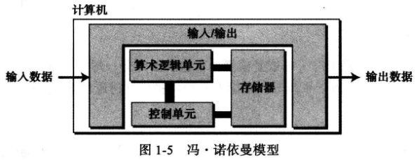

# Goals:

+ 图灵模型
+ 冯·诺依曼模型
+ 描述计算机的三大部分：硬件、数据和软件
+ 计算机的社会问题
+ 计算机简明历史

### 1.1 图灵模型

    所有的计算都能在一种特殊的机器上执行——图灵机。图灵机仅仅是一种数学概念。

#### 数据处理器

计算机可以被看作是一个`接收输入数据、处理数据并产生输出数据`的黑盒。

这种模型可以表示为一种设计用来完成特定任务的专用计算机使用。

但这种定义并不符合现代计算机的定义：现代计算机是一台 *通用* 的机器，可以完成不同的工作

#### 可编程数据处理器

**图灵模型**在数据处理器定义的基础上添加了一个额外的元素——`程序`。

**输出数据**依赖的是两方面因素的结合作用：
+ 输入数据
+ 程序

#### 程序

> 告诉计算机对数据进行处理的**指令集合**。

### 1.2 冯·诺依曼模型

程序能储存在计算机的储存器中的机器。

冯·诺依曼模型中要求程序必须存储在子内存中(以*位模式*存储，即0和1序列)。

冯·诺依曼模型中的一段程序是由一组数量有限的指令组成，指令按照顺序执行。

#### 程序

由一组数量有限的指令组成。控制单元从内存中提取一条指令，解释指令，接着按照顺序执行指令。

#### 子系统

基于冯诺依曼模型建造的计算机分为四个子系统：
+ 存储器
  > 储存数据和程序
+ 算术逻辑单元(ALU)
  > 对数据进行算术和逻辑运算
+ 控制单元
  > 对其他子系统进行控制操作
+ 输入/输出单元
  > 从计算机外部接受输入数据和程序；将计算机处理结果输出到计算机外部

### 1.3 计算机组成部分

我们可以认为计算机由三大部分组成：
+ 计算机硬件
+ 数据
+ 计算机软件

#### 数据

1. 存储数据
2. 组织数据

#### 计算机软件

图灵或冯诺依曼模型的组要特征是**程序**的概念。

1. 程序必须是存储的
2. 指令的序列
3. 算法
4. 计算机语言
5. 软件工程
6. 操作系统

### 1.4 历史

1. 机械计算机器(before 1930)
2. 电子计算机(1930 ~ 1950)
   1. 早期电子计算机
   2. 基于冯·诺依曼模型的计算机（EDVAC和EDSAC）
3. 现代计算机
   1. 第一代计算机(1950~1959)
   2. 第二代计算机(1959~1956)
      1. 晶体管代替真空管
      2. 两种高级程序设计语言的发明(FORTRAN和COBOL)
   3. 第三代计算机(1965~1975)
      1. 集成电路
      2. 软件工业的诞生
   4. 第四代计算机(1975~1985)
      1. 微型计算机
      2. 计算机网络的出现
   5. 第五代计算机(1985~)
      1. 掌上计算机
      2. 台式计算机
      3. 多媒体

### 1.5 社会问题和道德问题

#### 社会问题

+ 依赖
+ 社会公正
+ 数字化分裂

#### 道德问题

+ 隐私
+ 版权
+ 计算机犯罪

