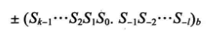
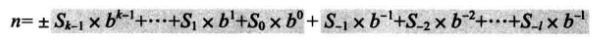
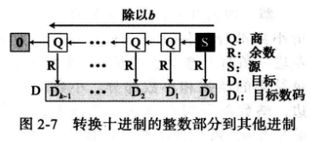
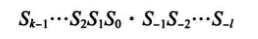
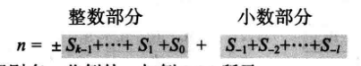

Goals：

+ 数字系统的概念
+ 非位置化和位置化数字系统
+ 不同进制的系统
+ 进制的相互转换

### 数字系统

**数字系统**定义了如何用独特的符号来表示一个数字。

数字系统可分为两类：
+ 位置化系统
+ 非位置化系统

### 位置化数字系统

数字中符号所占据的位置决定了其表示的值。

数字的表示：

值的表示：

b是**底**(或**基数**)，它等于S符号集中的符号总数。

### 进制转换

### 非位置化数字系统

非位置化系统符号所占的位置通常与值无关，每个符号的值是固定的。

数字：

值:

