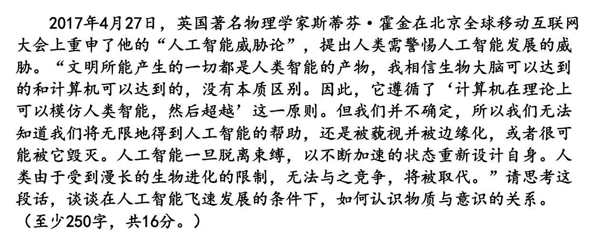

+ 知识罗列：
    * 物质决定意识。先有物质、后有意识，意识是物质世界长期发展的产物；
        意识离不开自己的 物质基础——人脑；
        意识的内容只能来自物质世界，离开了物质世界，人脑不会自行产生意识。
    * 物质是不依赖于人的意识并能为人的意识所反映的客观实在。
        意识是客观事物在人脑中的反映(客观事物的主观映像)。  
    * 物质决定意识，意识反映物质。
    * 物质和意识是辩证统一的，物质决定意识，意识对物质具有能动作用。
    * 物质决定意识和意识对物质具有能动作用是不可分割的两个方面，承认前者必须承认后者，反之亦然
    * 物质的决定作用和意识的能动作用是两种性质不同的作用，物质的决定作用是基础，是前提，是第一性的，意识的能动作用是第二性的，要受物质决定作用的制约。

`作答`

+ 物质决定意识。先有物质，后有意识，意识是物质世界长期发展的产物。文明所能产生的一切都是人类智能的产物，而从本质上来说，人脑和计算机没有区别：人的意识来源于大脑活动中产生的生物信号的传递；计算机的智能来源于其软件运行与硬件中电信号的传递。因此计算机在长期发展后也可能产生意识，无限的接近人类。
+ 意识是客观世界的主观映象，对物质具有能动作用。人工智能拥有了意识之后，因为其生命形态与人类的不同，因此能够突破人类的局限性，产生主动认识和改变世界的能力和活动，不断进化自身。

