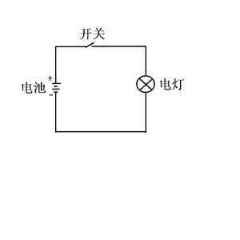
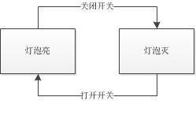
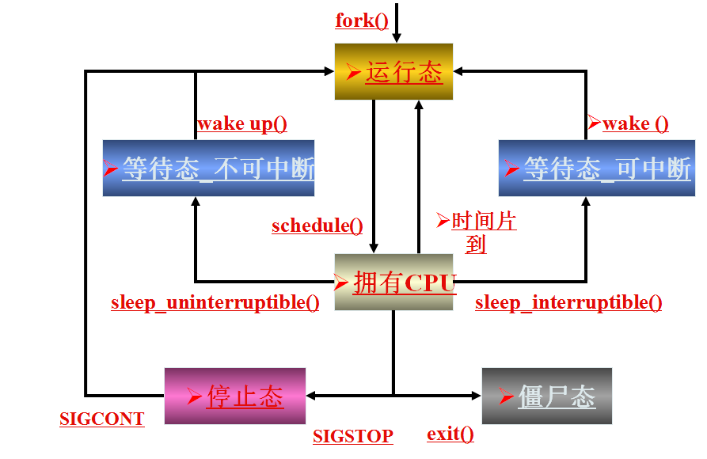
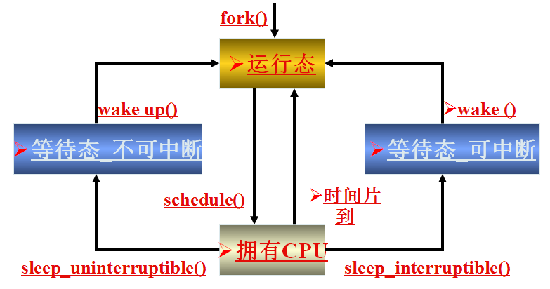
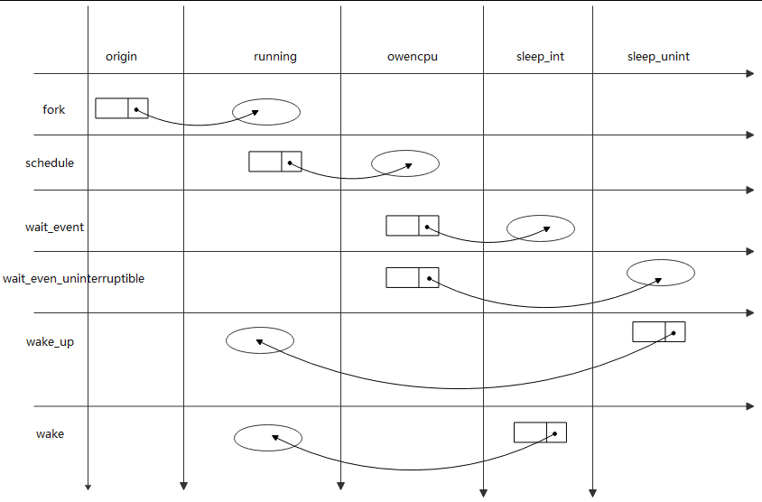
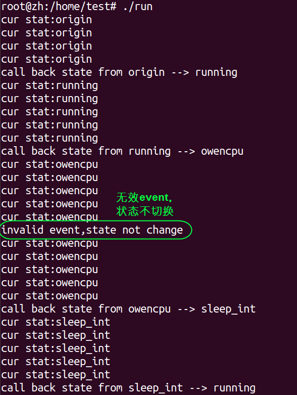

<!-- 状态机 -->

# 目录

+ [什么是状态机？](#define)
+ [状态机的四大概念](#concept)
+ [应用](#application)

---

<h1 id="define">什么是状态机？</h1>

### 定义

&emsp;状态机是有限状态自动机`(FSM,Finite State Machine)`的简称，是现实事物运行规则抽象而成的一个数学模型。

状态机主要分为两大类：

+ 若输出只和状态有关而与输入无关，则称为Moore状态机
+ 第二类，输出不仅和状态有关而且和输入有关系，则称为Mealy状态机

**什么是`“状态”`？**

&emsp;现实事物是有不同状态的，例如一个LED等，就有 亮 和 灭两种状态。我们通常所说的状态机是有限状态机，也就是被描述的事物的状态的数量是有限个，例如LED灯的状态就有两种：`亮`和`灭`。

&emsp;状态机，不是指一台实际机器，而是指一个数学模型。说白了，一般就是指一张状态转换图。

> 举例 :
>  以物理课学的灯泡图为例，就是一个最基本的小型状态机
> 
> 其状态机图：
> 
> 这里就是两个状态：`①灯泡亮`，`②灯泡灭` 
> 如果打开开关，那么状态就会切换为灯泡亮 。灯泡亮状态下如果关闭开关，状态就会切换为灯泡灭。

&emsp;状态机的全称是有限状态自动机，自动两个字也是包含重要含义的。

&emsp;给定一个状态机，同时给定它的当前状态以及输入，那么输出状态时可以明确的运算出来的。

&emsp;例如对于灯泡，给定初始状态灯泡灭 ，给定输入“打开开关”，那么下一个状态时可以运算出来的。

### 状态机的四大概念

+ **状态 State**。一个状态机至少要包含两个状态。例如上面灯泡的例子，有 灯泡亮和 灯泡灭两个状态。

+ **事件 Event**。事件就是执行某个操作的触发条件或者口令。对于灯泡，“打开开关”就是一个事件。

+ **动作 Action**。事件发生以后要执行动作。例如事件是“打开开关”，动作是“开灯”。编程的时候，一个 Action 一般就对应一个函数。

+ **变换 Transition**。也就是从一个状态变化为另一个状态。例如“开灯过程”就是一个变换。

### 状态机的应用

&emsp;状态机是一个对真实世界的抽象，而且是逻辑严谨的数学抽象，所以明显非常适合用在数字领域。可以应用到各个层面上，例如硬件设计，编译器设计，以及编程实现各种具体业务逻辑的时候。

举例: 进程5状态模型



关于该图的简单分析：

> 1. 可运行态：当进程正在被CPU执行，或已经准备就绪随时可由调度程序执行，则称该进程为处于运行状态（running）。进程可以在内核态运行，也可以在用户态运行。当系统资源已经可用时，进程就被唤醒而进入准备运行状态，该状态称为就绪态。
>
> 2. 浅度睡眠态（可中断）：进程正在睡眠（被阻塞），等待资源到来是唤醒，也可以通过其他进程信号或时钟中断唤醒，进入运行队列。
>
> 3. 深度睡眠态(不可中断)：其和浅度睡眠基本类似，但有一点就是不可由其他进程信号或时钟中断唤醒。只有被使用wake_up()函数明确唤醒时才能转换到可运行的就绪状态。
>
> 4. 暂停状态：当进程收到信号SIGSTOP、SIGTSTP、SIGTTIN或SIGTTOU时就会进入暂停状态。可向其发送SIGCONT信号让进程转换到可运行状态。
>
> 5. 僵死状态：当进程已停止运行，但其父进程还没有询问其状态时，未释放PCB，则称该进程处于僵死状态。

进程的状态就是按照这个状态图进行切换的。

该状态流程有点复杂，因为我们目标只是实现一个简单的状态机，所以我们简化一下该状态机如下：



要想实现状态机，首先将该状态机转换成下面的状态迁移表。



简要说明如下：
> &emsp;假设当前进程处于running状态下，那么只有schedule事件发生之后，该进程才会产生状态的迁移，迁移到owencpu状态下，如果在此状态下发生了其他的事件，比如wake、wait_event都不会导致状态的迁移。

如上图所示：

1. 每一列表示一个状态，每一行对应一个事件。
   
2. 该表是实现状态机的最核心的一个图，请读者详细对比该表和状态迁移图的的关系。
   
3. 实际场景中，进程的切换会远比这个图复杂，好在众多大神都帮我们解决了这些复杂的问题，我们只需要站在巨人的肩膀上就可以了。

#### 实现

根据状态迁移表，定义该状态机的状态如下：

```cpp
typedef enum {
  sta_origin=0,
  sta_running,
  sta_owencpu,
  sta_sleep_int,
  sta_sleep_unint
}State;
```

发生的事件如下：

```cpp
typedef enum{
  evt_fork=0,
  evt_sched,
  evt_wait,
  evt_wait_unint,
  evt_wake_up,
  evt_wake, 
}EventID;
```
不论是状态还是事件都可以根据实际情况增加调整。

定义一个结构体用来表示当前状态转换信息：

```cpp
typedef struct {
  State curState;//当前状态
  EventID eventId;//事件ID
  State nextState;//下个状态
  CallBack action;//回调函数，事件发生后，调用对应的回调函数
}StateTransform ; 
```

事件回调函数：
&emsp;实际应用中不同的事件发生需要执行不同的action，就需要定义不同的函数，为方便起见，本例所有的事件都统一使用同一个回调函数。

功能：打印事件发生后进程的前后状态，如果状态发生了变化，就调用对应的回调函数。

```cpp
void action_callback(void *arg)
{
 StateTransform *statTran = (StateTransform *)arg;
 
 if(statename[statTran->curState] == statename[statTran->nextState])
 {
  printf("invalid event,state not change\n");
 }else{
  printf("call back state from %s --> %s\n",
   statename[statTran->curState],
   statename[statTran->nextState]);
 }
}
```

为各个状态定义迁移表数组：

```cpp
/*origin*/
StateTransform stateTran_0[]={
 {sta_origin,evt_fork,        sta_running,action_callback},
 {sta_origin,evt_sched,       sta_origin,NULL},
 {sta_origin,evt_wait,        sta_origin,NULL},
 {sta_origin,evt_wait_unint,  sta_origin,NULL},
 {sta_origin,evt_wake_up,     sta_origin,NULL},
 {sta_origin,evt_wake,        sta_origin,NULL},
}; 
 
/*running*/
StateTransform stateTran_1[]={
 {sta_running,evt_fork,        sta_running,NULL},
 {sta_running,evt_sched,       sta_owencpu,action_callback},
 {sta_running,evt_wait,        sta_running,NULL},
 {sta_running,evt_wait_unint,  sta_running,NULL},
 {sta_running,evt_wake_up,     sta_running,NULL},
 {sta_running,evt_wake,        sta_running,NULL},
}; 
/*owencpu*/
StateTransform stateTran_2[]={
 {sta_owencpu,evt_fork,        sta_owencpu,NULL},
 {sta_owencpu,evt_sched,       sta_owencpu,NULL},
 {sta_owencpu,evt_wait,        sta_sleep_int,action_callback},
 {sta_owencpu,evt_wait_unint,  sta_sleep_unint,action_callback},
 {sta_owencpu,evt_wake_up,     sta_owencpu,NULL},
 {sta_owencpu,evt_wake,        sta_owencpu,NULL},
}; 
 
/*sleep_int*/
StateTransform stateTran_3[]={
 {sta_sleep_int,evt_fork,        sta_sleep_int,NULL},
 {sta_sleep_int,evt_sched,       sta_sleep_int,NULL},
 {sta_sleep_int,evt_wait,        sta_sleep_int,NULL},
 {sta_sleep_int,evt_wait_unint,  sta_sleep_int,NULL},
 {sta_sleep_int,evt_wake_up,     sta_sleep_int,NULL},
 {sta_sleep_int,evt_wake,        sta_running,action_callback},
}; 
/*sleep_unint*/
StateTransform stateTran_4[]={
 {sta_sleep_unint,evt_fork,        sta_sleep_unint,NULL},
 {sta_sleep_unint,evt_sched,       sta_sleep_unint,NULL},
 {sta_sleep_unint,evt_wait,        sta_sleep_unint,NULL},
 {sta_sleep_unint,evt_wait_unint,  sta_sleep_unint,NULL},
 {sta_sleep_unint,evt_wake_up,     sta_running,action_callback},
 {sta_sleep_unint,evt_wake,        sta_sleep_unint,NULL},
}; 
```

实现event发生函数：

```cpp
void event_happen(unsigned int event)
/**
 * 功能：
 * 根据发生的event以及当前的进程state，找到对应的StateTransform 结构体
 * 并调用do_action()
*/
```

```cpp
void do_action(StateTransform *statTran)
/**
 * 功能：
 * 根据结构体变量StateTransform，实现状态迁移，并调用对应的回调函数。
*/
```

```cpp
#define STATETRANS(n)  (stateTran_##n)
/*change state & call callback()*/
void do_action(StateTransform *statTran)
{
 if(NULL == statTran)
 {
  perror("statTran is NULL\n");
  return;
 }
 //状态迁移
 globalState = statTran->nextState;
 if(statTran->action != NULL)
 {//调用回调函数
  statTran->action((void*)statTran);
 }else{
  printf("invalid event,state not change\n");
 }
}
void event_happen(unsigned int event)
{
 switch(globalState)
 {
  case sta_origin:
   do_action(&STATETRANS(0)[event]);
   break;
  case sta_running:
   do_action(&STATETRANS(1)[event]);
   break;
  case sta_owencpu:
   do_action(&STATETRANS(2)[event]); 
   break;
  case sta_sleep_int:
   do_action(&STATETRANS(3)[event]); 
   break;
  case sta_sleep_unint:
   do_action(&STATETRANS(4)[event]); 
   break;
  default:
   printf("state is invalid\n");
   break;
 }
}
```

测试程序：功能：

1. 初始化状态机的初始状态为sta_origin；

2. 创建子线程，每隔一秒钟显示当前进程状态；

3. 事件发生顺序为：evt_fork-->evt_sched-->evt_sched-->evt_wait-->evt_wake。

读者可以跟自己的需要，修改事件发生顺序，观察状态的变化。

`main.c`

```cpp
/*显示当前状态*/
void *show_stat(void *arg)
{
 int len;
 char buf[64]={0};
 
 while(1)
 {
  sleep(1);
  printf("cur stat:%s\n",statename[globalState]);
 } 
}
void main(void)
{
 init_machine();
 //创建子线程，子线程主要用于显示当前状态
 pthread_create(&pid, NULL,show_stat, NULL);
 
 sleep(5);
 event_happen(evt_fork);
 
 sleep(5);
 event_happen(evt_sched);
 sleep(5);
 event_happen(evt_sched);
 sleep(5);
 event_happen(evt_wait);
 sleep(5);
 event_happen(evt_wake);
 
}
 
```

运行结果：



可知：
`evt_fork-->evt_sched-->evt_sched-->evt_wait-->evt_wake`

该事件发生序列对应的状态迁移顺序为：

`origen-->running-->owencpu-->owencpu-->sleep_int-->running`
