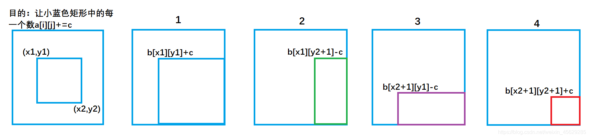

## 目录

+ [前缀和](#1)
+ [差分](#2)


---

<br>

<h1 id="1">前缀和</h1>

---

[一维前缀&后缀和/积](https://blog.csdn.net/qq_44625728/article/details/124379436?spm=1001.2014.3001.5502)

---

### 二维前缀和

**先给出问题：**

> &emsp;输入一个n行m列的整数矩阵，再输入q个询问，每个询问包含四个整数x1, y1, x2, y2，表示一个子矩阵的左上角坐标和右下角坐标。
对于每个询问输出子矩阵中所有数的和。

&emsp;同一维前缀和一样，我们先来定义一个二维数组s[][], s[i][j]表示二维数组中，左上角(1,1)到右下角( i,j )所包围的矩阵元素的和。接下来推导二维前缀和的公式。


**紫色面积**是指(1,1)左上角到(i,j-1)右下角的矩形面积, **绿色面积**是指(1,1)左上角到(i-1, j )右下角的矩形面积。**每一个颜色的矩形面积都代表了它所包围元素的和。**


&emsp;从图中我们很容易看出，整个外围蓝色矩形面积`s[i][j]` = 绿色面积`s[i-1][j]` + 紫色面积`s[i][j-1]` - 重复加的红色的面积`s[i-1][j-1]`+小方块的面积`a[i][j]`;

因此得出二维前缀和预处理公式

`s[i] [j] = s[i-1][j] + s[i][j-1 ] + a[i] [j] - s[i-1][ j-1]`

接下来回归问题去求以`(x1,y1)`为左上角和以`(x2,y2)`为右下角的矩阵的元素的和。


**紫色面积**是指`( 1,1 )`左上角到`(x1-1,y2)`右下角的矩形面积 。
**黄色面积**是指`(1,1)`左上角到`(x2,y1-1)`右下角的矩形面积。

则可得:


绿色矩形的面积 = 整个外围面积`s[x2, y2]` - 黄色面积`s[x2, y1 - 1]` - 紫色面积`s[x1 - 1, y2]` + 重复减去的红色面积 `s[x1 - 1, y1 - 1]`

---

### 结论

以`(x1, y1)`为左上角，`(x2, y2)`为右下角的子矩阵的和为：

> s[x2, y2] - s[x1 - 1, y2] - s[x2, y1 - 1] + s[x1 - 1, y1 - 1]

由此得到题解：

```cpp
#include<iostream>
#include<cstdio>
using namespace std;
const int N=1010;
int a[N][N],s[N][N];
int main()
{
    int n,m,q;
    scanf("%d%d%d",&n,&m,&q);
    for(int i=1;i<=n;i++)
      for(int j=1;j<=m;j++)
       scanf("%d",&a[i][j]);
    for(int i=1;i<=n;i++)
      for(int j=1;j<=m;j++)
        s[i][j]=s[i-1][j]+s[i][j-1]+a[i][j]-s[i-1][j-1];
    while(q--)
    {
        int x1,y1,x2,y2;
        scanf("%d%d%d%d",&x1,&y1,&x2,&y2);
        printf("%d\n",s[x2][y2]-s[x2][y1-1]-s[x1-1][y2]+s[x1-1][y1-1]);
    }
    return 0;
}

```

---

<br>

<h1 id="2">差分</h1>

**差分可以看成前缀和的逆运算。**

---

### 差分数组：

首先给定一个**原数组a**：
`a[1], a[2], a[3] ... a[n]`

然后我们构造一个**数组b** ： 
`b[1] ,b[2] , b[3] ... b[i]`

使得 
`a[i] = b[1] + b[2 ]+ b[3] + ... + b[i]`

&emsp;也就是说，a数组是b数组的**前缀和数组**，反过来我们把b数组叫做a数组的差分数组。
&emsp;即，**每一个a[i]都是b数组中从头开始的一段区间和**。

---

### 构造差分数组

最为直接的方法：


我们只要有b数组，通过前缀和运算，就可以在O(n) 的时间内得到a数组。

---

### 差分的应用

> 输入一个长度为n的整数序列。
  接下来输入m个操作，每个操作包含三个整数l, r, c，表示将序列中[l, r]之间的每个数加上c。
请你输出进行完所有操作后的序列。

#### 暴力做法

&emsp;for循环l到r区间，时间复杂度`O(n)`，如果我们需要对原数组执行m次这样的操作，时间复杂度就会变成`O(n*m)`。

#### 差分做法

始终要记得，a数组是b数组的前缀和数组，比如对b数组的b[i]的修改，会影响到a数组中从a[i]及往后的每一个数。

首先让差分b数组中的 `b[l] + c` ,通过前缀和运算，a数组变成 `a[l] + c ,a[l+1] + c ... a[n] + c`

然后我们打个补丁: `b[r+1] - c` , 通过前缀和运算，a数组变成 `a[r+1] - c,a[r+2] - c ... a[n] - c`


#### 分析

&emsp;`b[l] + c` 使得a数组中`a[l]`及以后的数都加上了c(红色部分)，但我们只要求l到r区间加上c。

&emsp;因此还需要执行`b[r+1] - c`,让a数组中`a[r+1]`及往后的区间再减去c(绿色部分)，这样对于`a[r]`以后区间的数相当于没有发生改变。

#### 一维差分结论

> 给a数组中的[l, r]区间中的每一个数都加上c,只需对差分数组b做：
> `b[l] += c, b[r+1] -= c`
> 时间复杂度为O(1), 大大提高了效率。

*代码清单：*

```cpp
#include<iostream>
using namespace std;
const int N=1e5+10;
int a[N],b[N]; 
int main()
{
    int n,m;
    scanf("%d%d",&n,&m);
    for(int i=1;i<=n;i++) 
    {
        scanf("%d",&a[i]);
        b[i]=a[i]-a[i-1];      //构建差分数组
    }
    int l,r,c;
    while(m--)
    {
        scanf("%d%d%d",&l,&r,&c);
        b[l]+=c;     //表示将序列中[l, r]之间的每个数加上c
        b[r+1]-=c;
    }
    for(int i=1;i<=n;i++) 
    {
        b[i]+=b[i-1];  //求前缀和运算
        printf("%d ",b[i]);
    }
    return 0;
}
```

---

### 二维差分

&emsp;如果扩展到二维，我们需要让二维数组被选中的子矩阵中的每个元素的值加上c,是否也可以达到O(1)的时间复杂度。
&emsp;答案是可以的，考虑二维差分。

#### 构造差分数组

原数组： `a[i][j]`

我们去构造差分数组： `b[i][j]`

使得a数组中`a[i][j]`是b数组左上角`(1,1)`到右下角`(i,j)`所包围矩形元素的和。

**构造b数组：**

&emsp;其实关于差分数组，我们并不用考虑其构造方法，因为我们使用差分操作在对原数组进行修改的过程中，实际上就可以构造出差分数组。

&emsp;已知原数组a中被选中的子矩阵为 以(x1,y1)为左上角，以(x2,y2)为右下角所围成的矩形区域。

&emsp;始终要记得，**a数组是b数组的前缀和数组**，对b数组的b[i][j]的修改，会影响到a数组中从a[i][j]及往后的每一个数。

&emsp;假定我们已经构造好了b数组，类比一维差分，我们执行以下操作,来使被选中的子矩阵中的每个元素的值加上c :

> b[x1][y1] + = c;
  b[x1,][y2+1] - = c;
  b[x2+1][y1] - = c;
  b[x2+1][y2+1] + = c;

每次对b数组执行以上操作，等价于：

```cpp
for(int i=x1;i<=x2;i++)
  for(int j=y1;j<=y2;j++)
    a[i][j]+=c;
```


`b[x1][ y1 ] +=c` 对应图1 ,让整个a数组中**蓝色矩形面积**的元素都加上了c。
`b[x1,][y2+1]-=c` 对应图2 ,让整个a数组中**绿色矩形面积**的元素再减去c，使其内元素不发生改变。
`b[x2+1][y1]- =c` 对应图3 ,让整个a数组中**紫色矩形面积**的元素再减去c，使其内元素不发生改变。
`b[x2+1][y2+1]+=c` 对应图4,让整个a数组中**红色矩形面积**的元素再加上c，红色内的相当于==被减了两次==，再加上一次c，才能使其恢复。



将上述操作封装成函数：

```cpp
void insert(int x1,int y1,int x2,int y2,int c)
{    
    b[x1][y1]+=c;
    b[x2+1][y1]-=c;
    b[x1][y2+1]-=c;
    b[x2+1][y2+1]+=c;
}
```

&emsp;我们可以先假想a数组为空，那么b数组一开始也为空，但是实际上a数组并不为空。

&emsp;因此我们每次让以`(i,j)`为左上角到以(`i,j)`为右下角面积内元素(其实就是一个小方格的面积)去插入 `c=a[i][j]` 。

&emsp;等价于原数组a中`(i,j)`到`(i,j)`范围内 加上了 `a[i][j]` ,因此执行n*m次插入操作，就成功构建了差分b数组。


**直接构造公式**

> b[i][j] = a[i][j] − a[i−1][j] − a[i][j−1] + a[i−1][j−1]