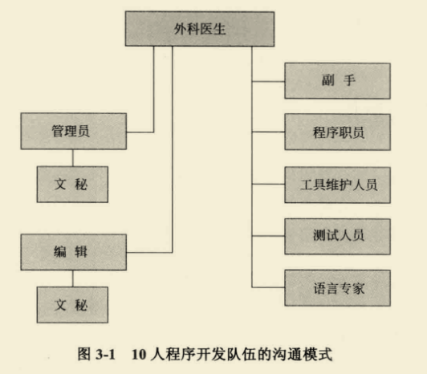

# 乐观主义

系统编程进度安排背后的第一个错误假设：
`一切都将运作良好`

计算机编程基于十分容易掌握的介质，编程人员通过纯粹的思维活动——概念以及灵活的变现形式来开发程序，我们往往会期待在实现过程中不会碰到困难，即"乐观主义"。

而我们的构思是有缺陷的，因此总会发现bug。也就是说，我们的乐观主义并不应该是理所当然的。

---

# 人月

人月：`在估计进度和安排中使用的工作量单位`
> 即人力和时间

成本确实随着开发产品的人数和时间的不同，有着很大的变化，但是进度却不是如此。

**因此，用`人月`作为衡量一项工作的规模是一个危险和带有欺骗性的神话。**

人数和时间的互换，仅仅适用于一下情况：
> 某个任务可以分解给参与人员，并且**他们之间不需要相互的交流**
> 例如割小麦和种棉花等
> 但在系统编程中，这近乎不可能

当任务由于次序的限制而不能分解时，**人手的添加对进度没有任何帮助**。
> 无论是哪位母亲，孕育一个生命都需要十个月

对于可分解，但子任务之间需要相互沟通和交流的任务，必须在计划工作中考虑沟通的工作量。
沟通会添加额外的负担，这些负担主要由两部分组成：`培训和相互的交流`

对于关系错综复杂的任务，单纯的堆加人数可能还会导致情况无比糟糕。

---

# 软件任务的进度安排

**Brooks法则：`向进度落后的项目中增加人手，只会使进度更加落后。`**

# 外科手术队伍

对于效率和概念的完整性来说，最好由少数干练的人员来设计和开发。而对于大型系统，则需要大量的人手，以使产品能早时间上满足要求。如何调节这两方面的矛盾呢？

`Mills概念`：

由一个人来完成问题的分解，将大型项目的每一个部分由一个团队解决，每个团队以类似外科手术的方式组建，而非一拥而上。

### 外科医生

首席程序员，亲自定义功能和性能技术说明书，设计程序，编制源代码，测试以及书写技术文档。

### 副手

外科医生的后备，能够完成任何一部分工作，但是相对具有的经验较少。主要作用是作为设计的思考者、讨论者和评估人员。充当外科医生的保险机制。但对代码的任何部分，不承担具体的开发职责。

### 管理员

老板，负责在人员、薪酬、办公空间等方面具有决定权，但不能在这些事物上浪费任何时间。（即只负责签字和一锤定音）

### 编辑

编辑根据外科医生的草稿或者口述，进行分析和重新组织文档，提供各种参考信息和书目，并且监督文档生成的机制。

### 文秘

管理员和编辑每个人需要一个文秘。管理员的文秘负责非产品文件和项目协作一致。

### 程序职员

负责维护编程产品库中所有团队的技术记录，承担机器码文件和可读文件的相关管理责任。

### 工具维护人员

保证所有基本服务的可靠性，承担团队成员所需要的特殊工具（特别是交互式计算机服务）的构建、维护和升级责任。常常需要开发一些实用程序，编制具有目录的函数库和宏库。

### 测试人员

为外科医生的各个功能设计系统测试用例的对手，也是为外科医生的日常调试设计测试数据的助手。同时还负责计划测试的步骤和为单元测试搭建测试平台。

### 语言专家

语言专家掌握多种复杂编程语言。其职责是寻找一种简介、有效的使用语言的方法来解决复杂、晦涩或者棘手的问题。

**Mills概念的真正关键：**`"从个人艺术到公共实践"的编程观念转换`

 