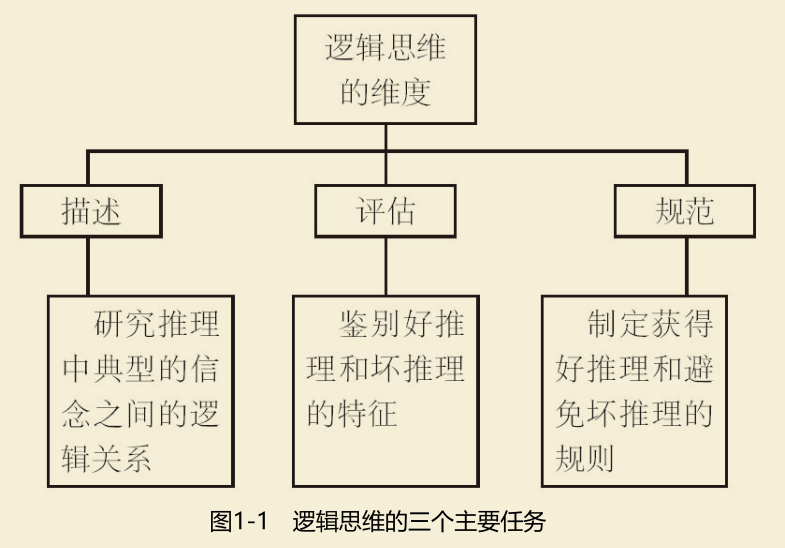

+ 什么是逻辑思维？
+ 推理与论证
+ 非形式谬误
+ 演绎推理

---

# 什么是逻辑思维

**主题：** `推论的成立与不成立`

### 推论/论证

推论/论证 : `一种逻辑关系，描述一个或多个信念被用来支持另一个信念`

+ 强推论：
  > 所有鲸鱼都是哺乳动物，并且莫比·迪克是鲸鱼，因此，莫比·迪克
是哺乳动物
+ 弱推论
  > 没有来自佛罗里达的橘子是小的，因此，没有来自美国的橘子是小
的。
+ 不成立推论
  + 信念均为真，但彼此间因果关系有误
    > 没有橘子是苹果，因此，所有榆木都是树。
  + 虚假的信念：信念之间毫无关系，不能支持对方
    > 所有律师都是瘦的，因此，现任教皇是中国人。

### 逻辑思维的维度

1. **描述**推理的模式
2. **评估**决定推理好坏的特征
3. 制定能最大限度地解释好推理所具有的特征的**规则**

### 逻辑的分类

+ 形式逻辑(符号逻辑)

&emsp;任何形式逻辑系统都包含基本的符号表达式、形式语言的初级词汇及运算规则。

&emsp;在形式逻辑中，推论是公式之间的关系，即当一个公式可以从另一个或多个公式推出时，该关系成立.

例子：
> 数学、理论物理学

+ 非形式逻辑(逻辑思维)

&emsp;逻辑思维则完全地集中于实际推理中的逻辑关系研究。逻辑分析基于自然语言。

研究对象：`信念或者信念的语言学表达（即陈述）之间的推理关系`

&emsp;描述特定推论的基本逻辑关系就是对其进行评估并确定是否符合有效推理的规则。

例子：
> 刑事诉讼、哲学问题、政治决策

### 什么是论证

论证和推论的关系：

> “推论”就是一个或多个信念对另一个信念的支持关系

> “论证”是一个或多个陈述支持另一个陈述的关系。

**陈述**
+ 陈述是论证的构件
+ 陈述具有真假值，每一个陈述要么是真的要么是假的
+ 只有表达信念的句子才能做出陈述

论证的基本特点：

&emsp;每个论证必须至少由两个陈述构成；一个提出断言，另一个支持断言。

&emsp;提出断言的陈述是结论，而支持断言的陈述是前提（可以有一个或多个前提）。

### 论证和非论证

&emsp;通过检验一个论证的某些语句是否支持一个断言，就可以将论证与语句间的其他逻辑关系区分开来。

> 在论证中，理由（论据）是用来支持一个思考者认为需要支持的断言(论题); 
> 逻辑关系存在于某个断言和用来为接受“该断言为真”提供理由的语句

> 在解释中，理由是用来解释一个思考者认为不需要支持的断言所描述的事件或事态;
> 逻辑关系存在于思考者已经接受为真的某个断言和用来解释该断言为什么或如何为真的语句（一个或多个）之间

### 论证分析

1. 论证重构

&emsp;确定一个论证的论题和论据，并把论证的各个部分有序的组织起来。

论据的基本性质：`用来支持另一个语句（论题）的语句`

> 原则上，一个论证的论据数量没有上线

2. 论证评估

---

# 推理与论证

---

# 非形式谬误

---

# 演绎推理

---